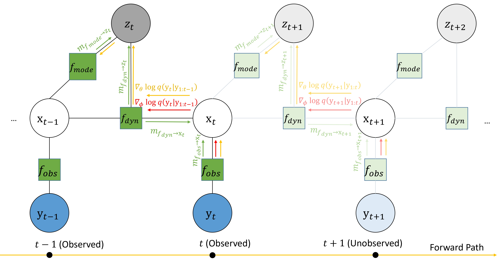
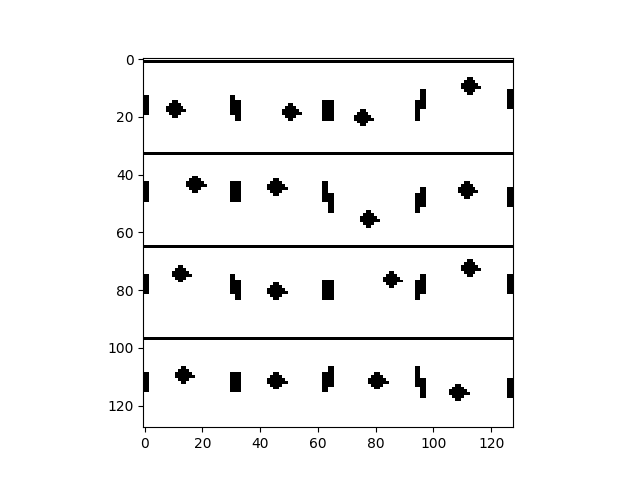
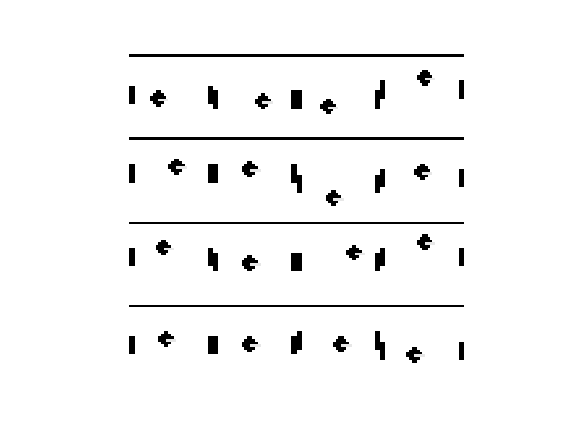

# Structured Temporal Inference in Hybrid State-Space Models
This is a, commented version of the Code used for the experiments described in the paper.
Submission for ICLR 2026

## Framework



## Demo (sequence generation/imputation)


<!--   -->
*  Navier-Stokes Environment
<p align="center">
  
  
</p>

*  Poly Environment
<p align="center">
  
  
</p>


## Requirements

Python 3.8 or later with all ```requirements.txt``` dependencies installed. To install run:
```bash
$ pip install -r requirements.txt
```

## Code
### Data Preparation
The data for Pong (PolyBox), Lorenz Attractor and NCLT experiments
are synthetized and generated as explained in details bellow.

For simplicity, we are calling data generation modules in the ``main_script`` so can skip the data generation section.
Data generation `.py` files for Poly, Lorenz and NCLT experiments:

>   * project dir
>     * Lorenz
>       * `LorenzSysModel.py`
>     * NCLT
>       * `NCLT_data.py`
>     * Poly
>       * `PolyboxData.py`
>       * `PymunkData.py`    


### Experiments
If you just want run the experiments, you can directly run the ``main_script`` of each experiment as follow:


* Pong state estimation
 ```
cd double polybox state estimation
python polybox_state_estimation.py --config config0.json
cd ..
```
After running the code, dataset will be generated in `Poly/data` folder and the results are saved at 
`polybox state estimation/results`.


* Lorenz state estimation
 ```
cd Lorenz
python lorenz_state_estimation.py 
cd ..
```


* NCLT state estimation
 ```
cd NCLT
python NCLT_state_estimation.py 
cd ..
```
To run NCLT experiment, you need to download the dataset from their [web](https://robots.engin.umich.edu/nclt/).


